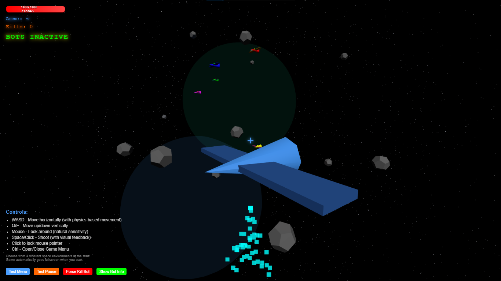
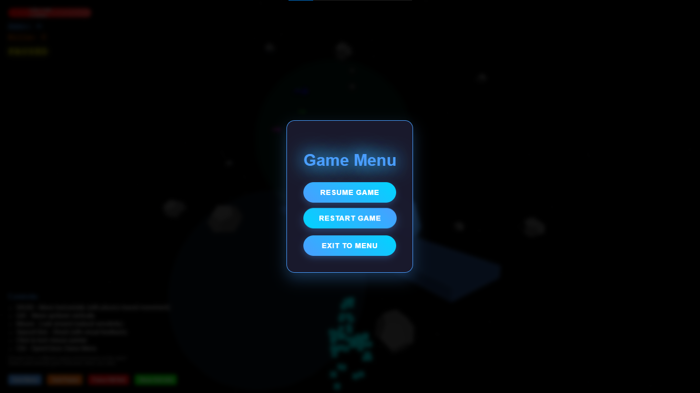
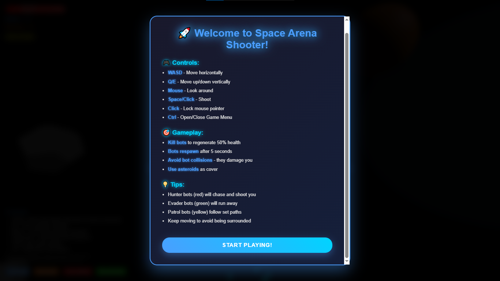

# 3D Space Arena Shooter 🚀

A multiplayer 3D space shooter game built with Three.js and WebSocket technology.

## Features

### 🎮 Gameplay
- **3D Space Combat**: Navigate through stunning space environments
- **Multiplayer Support**: Real-time multiplayer battles with WebSocket
- **Standard PC Controls**: WASD movement, mouse look, space/click to shoot
- **Beautiful Visuals**: Particle effects, engine trails, and dynamic lighting

### 🗺️ Map Environments
Choose from 4 unique space battlefields:

1. **Nebula Fields** 🌌
   - Colorful cosmic clouds and distant stars
   - Mystical atmosphere with multiple nebula effects
   - Moderate asteroid density for tactical gameplay

2. **Asteroid Belt** ☄️
   - Dense asteroid field with floating debris
   - Use rocks as cover and navigate through obstacles
   - High asteroid count for intense combat

3. **Planetary Rings** 🪐
   - Massive planet with spectacular rings
   - Gravitational effects on movement
   - Unique tactical opportunities

4. **Deep Void** 🌌
   - Infinite darkness with distant galaxies
   - Minimal cover for fast-paced combat
   - Sparse asteroid field for open battles

## 📸 Screenshots

### Game Screenshots

*Intense 3D space combat gameplay showing the player's spaceship in action*

### UI Screenshots

*Game menu interface with options for resuming, restarting, or exiting the game*


*Comprehensive instructions popup showing game controls, gameplay tips, and how to play*

## 🚀 Complete Setup Guide

### Prerequisites
- **Node.js** (v14 or higher) - [Download here](https://nodejs.org/)
- **Python** (v3.7 or higher) - [Download here](https://python.org/)
- **Git** - [Download here](https://git-scm.com/)

### Step 1: Clone the Repository
```bash
git clone <repository-url>
cd my-3d-arena-shooter
```

### Step 2: Fix PowerShell Execution Policy (Windows Only)
If you're on Windows and get npm errors, run this in PowerShell as Administrator:
```powershell
Set-ExecutionPolicy -ExecutionPolicy RemoteSigned -Scope CurrentUser
```

### Step 3: Install Frontend Dependencies
```bash
# Install npm packages
npm install

# Install http-server globally (if not already installed)
npm install -g http-server
```

### Step 4: Install Backend Dependencies
```bash
# Navigate to backend directory
cd backend

# Install Python dependencies
pip install -r requirements.txt

# Return to project root
cd ..
```

### Step 5: Start the Development Server
```bash
# Start the frontend development server
npm run dev
```

The game will automatically open in your browser at `http://localhost:3000`

**Alternative: Direct GitHub Pages Setup**
Since the main files are now in the root directory, you can also:
1. Push to GitHub
2. Enable GitHub Pages in repository settings
3. Your game will be live at `https://yourusername.github.io/my-3d-arena-shooter/`

### Step 6: Start Backend Server (Optional - for Multiplayer)
Open a new terminal window and run:
```bash
cd backend
python server.py
```

The backend will start on `http://localhost:5000`

## 🎯 How to Play

### Starting the Game
1. **Map Selection**: Choose from 4 different space environments
2. **Click "Start Game"**: The selected environment will load
3. **Loading Screen**: Wait for the 3D environment to initialize
4. **Game Begins**: You'll see your spaceship in the chosen environment

### Controls
- **WASD** - Move (standard PC game controls)
- **Mouse** - Look around (natural sensitivity)
- **Space/Click** - Shoot
- **Click canvas** - Lock mouse pointer

### Gameplay Tips
- **Use asteroids as cover** in dense environments
- **Navigate carefully** through asteroid fields
- **Watch for other players** in multiplayer mode
- **Experiment with different maps** for varied gameplay

## 🛠️ Technology Stack
- **Frontend**: Three.js, Vanilla JavaScript, HTML5, CSS3
- **Backend**: Python Flask, Flask-SocketIO
- **Game Logic**: C++ with Python bindings (optional)
- **Real-time**: WebSocket communication

## 🌟 Features
- Beautiful map selector with animated previews
- Dynamic space environments with unique characteristics
- Real-time multiplayer support
- Particle effects and visual feedback
- Responsive controls optimized for PC gaming
- Loading screen with progress tracking

## 🔧 Troubleshooting

### Common Issues

**npm command not found**
- Install Node.js from [nodejs.org](https://nodejs.org/)
- Restart your terminal after installation

**PowerShell execution policy error**
```powershell
Set-ExecutionPolicy -ExecutionPolicy RemoteSigned -Scope CurrentUser
```

**Python not found**
- Install Python from [python.org](https://python.org/)
- Make sure to check "Add Python to PATH" during installation

**Port already in use**
- Close other applications using port 3000 or 5000
- Or change ports in the respective configuration files

**Backend connection failed**
- Make sure the backend server is running on port 5000
- Check firewall settings
- Verify Python dependencies are installed

### Development Commands
```bash
# Start frontend development server
npm run dev

# Start frontend without auto-opening browser
npm start

# Install new dependencies
npm install <package-name>

# Update dependencies
npm update
```

## 📁 Project Structure
```
my-3d-arena-shooter/
├── index.html         # Main HTML file (for GitHub Pages)
├── frontend/          # Frontend game files
│   ├── main.js       # Game logic and Three.js code
│   └── style.css     # Styling and animations
├── screenshots/       # Game screenshots for README
├── backend/           # Backend server files
│   ├── server.py     # Flask server with WebSocket
│   ├── game_logic.py # Game logic and C++ bindings
│   └── requirements.txt # Python dependencies
├── cpp/              # C++ game logic (optional)
│   ├── cpp_logic.cpp # C++ implementation
│   └── CMakeLists.txt # Build configuration
└── package.json      # Node.js dependencies
```

## 🤝 Contributing
1. Fork the repository
2. Create a feature branch
3. Make your changes
4. Test thoroughly
5. Submit a pull request

## 📝 License
This project is licensed under the MIT License.

---

**Enjoy your space battles!** 🚀✨

*Ready to explore the cosmos and engage in epic space combat? Choose your battlefield and start your journey!* 